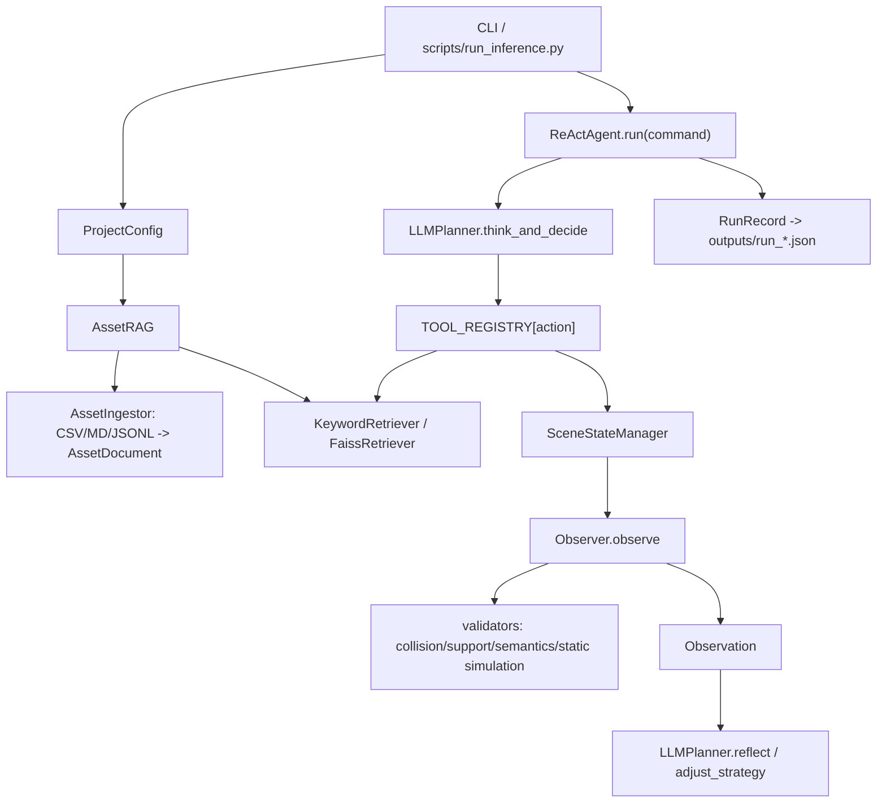
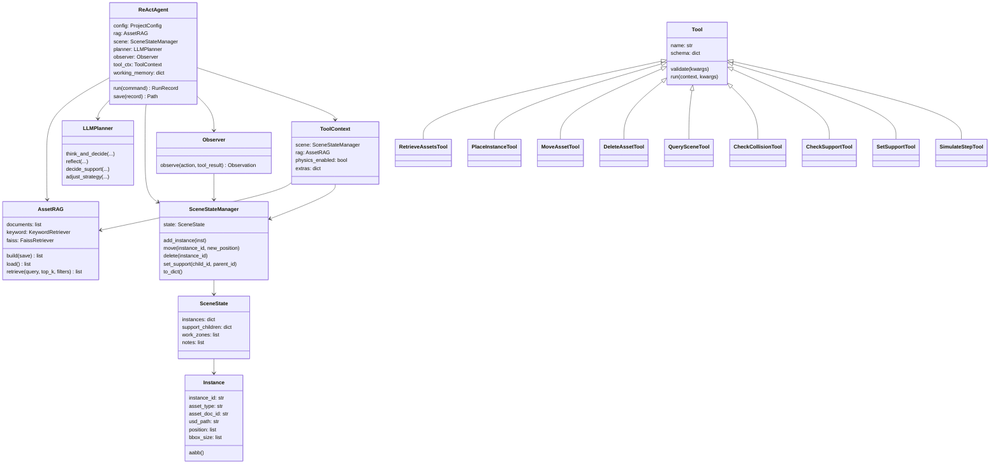

# AGENT.md

## 项目定位

`scene_synthesis` 是一个工业场景合成原型项目，核心范式是：

- 本地/兼容 OpenAI SDK 的 LLM 负责规划。
- RAG 负责从资产清单和场景模板中检索可用对象与布局先验。
- ReAct agent 通过工具链逐步放置、移动、删除、查询和验证场景对象。
- 每一步通过 observer 做碰撞、支撑、场景语义和静态物理反馈。

## 项目结构

```text
/Users/bytedance/python_proj/scene_synthesis
├── README.md                         # 总体说明、运行方式、架构说明
├── AGENT.md                          # 项目结构、核心链路、类关系
├── PLAN.md                           # 完成度、实验管理、验证结论
├── requirements.txt                  # Python 依赖
├── scripts/
│   └── run_inference.py              # 端到端推理入口
├── scene_layout_rag/                 # 主代码包
│   ├── agent/
│   │   └── react_agent.py            # ReActAgent、RunRecord、StepRecord
│   ├── tools/                        # 工具系统和工具注册
│   │   ├── base.py                   # Tool、ToolContext、ToolResult、registry
│   │   ├── retrieve_assets.py        # retrieve_scene_template / retrieve_assets
│   │   ├── place_instance.py         # 放置资产实例
│   │   ├── move_asset.py             # 移动实例
│   │   ├── delete_asset.py           # 删除实例
│   │   ├── query_scene.py            # 查询场景状态
│   │   ├── check_collision.py        # AABB/Isaac 接口碰撞检测
│   │   ├── check_support.py          # 支撑关系检查
│   │   ├── set_support.py            # 支撑关系登记
│   │   └── simulate_step.py          # 静态/Isaac 仿真步
│   ├── prompts/
│   │   └── templates.py              # think/reflect/support/strategy prompts
│   ├── physics/
│   │   └── isaac_bridge.py           # IsaacSim 接口占位
│   ├── asset_loader.py               # CSV/MD/JSONL -> AssetDocument
│   ├── cli.py                        # ingest / retrieve / run
│   ├── config.py                     # ProjectConfig、ModelConfig、AgentConfig
│   ├── data_models.py                # AssetDocument、Instance、SceneState 等
│   ├── llm_planner.py                # LLMPlanner，JSON/tool 调用解析
│   ├── observer.py                   # Observation 组装
│   ├── rag.py                        # corpus、BM25-lite、FAISS 检索
│   ├── scene_state.py                # SceneStateManager
│   ├── template_parser.py            # 从模板文本抽取布局骨架
│   └── validators.py                 # AABB、支撑、语义、静态仿真规则
├── data/
│   ├── assets/
│   │   ├── csv/                      # 10 类资产 CSV，含 USD path / bbox / tags
│   │   └── md/                       # brief / verbose 场景模板
│   └── indexes/
│       ├── corpus.jsonl              # RAG 事实源
│       ├── vectors.faiss             # FAISS 向量索引
│       └── index_meta.json           # FAISS 与 corpus 对齐信息
├── outputs/                          # 每次 ReAct 运行轨迹 run_*.json
├── dataprocess/                      # USD/USDA 离线处理脚本
└── 方案/
    └── 优化.md                       # 原始优化方案
```

## 核心链路



## ReAct 执行流程

```text
ReActAgent.run(command)
  for step in max_steps:
    1. scene_summary = ReActAgent._scene_summary()
    2. LLMPlanner.think_and_decide(...)
       -> {"thought": "...", "action": "...", "action_input": {...}}
    3. TOOL_REGISTRY[action](ToolContext, **action_input)
       -> ToolResult
    4. Observer.observe(action, ToolResult)
       -> Observation
    5. if observation.ok is false:
         LLMPlanner.reflect(...)
         RunRecord.lessons append Lesson
    6. if consecutive failures >= 2:
         LLMPlanner.adjust_strategy(...)
    7. if action == "finish":
         stop
  save final SceneState into RunRecord.final_scene
```

## 关键类关系



## 数据流

```text
data/assets/csv/*.csv
data/assets/md/*.md
data/assets/docs/*.jsonl
        |
        v
AssetIngestor.build_documents()
        |
        v
data/indexes/corpus.jsonl
        |
        +--> KeywordRetriever
        +--> FaissRetriever -> vectors.faiss / index_meta.json
        |
        v
retrieve_assets / retrieve_scene_template
        |
        v
place_instance / move_asset / set_support / ...
        |
        v
SceneState
        |
        v
Observer + validators
        |
        v
outputs/run_<timestamp>.json
```

## 当前注册工具

当前实际注册工具为 10 个：

- `check_collision`
- `check_support`
- `delete_asset`
- `move_asset`
- `place_instance`
- `query_scene`
- `retrieve_scene_template`
- `retrieve_assets`
- `set_support`
- `simulate_step`

README 中说 9 个工具，是因为最初把检索写成一个工具；当前实现拆成了 `retrieve_scene_template` 和 `retrieve_assets`。
